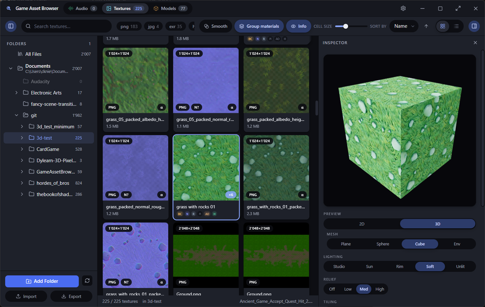
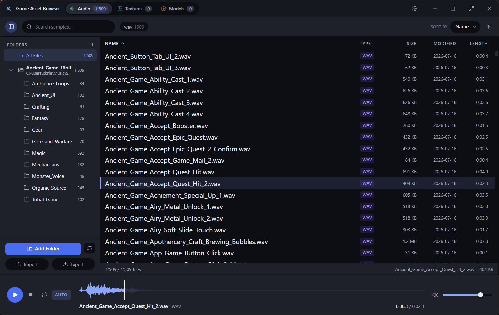
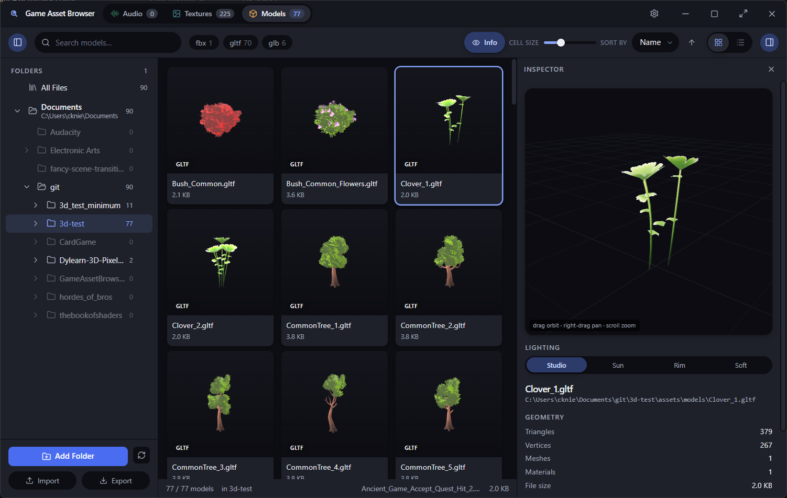

# Game Asset Browser

A fast, dark‑mode desktop browser for game asset libraries — **audio, textures, and 3D
models in one place**, with instant preview and without opening a game engine. Built for
big packs (Synty, ambientCG / freestylized, Megascans, HDRIs, Kenney, SFX libraries) where
your file explorer gives up and the engine importer is too slow to browse.

<p align="center">
  
</p>

One library, three lenses. The sidebar folder tree, collections, search, and filters are
shared; each tab (Audio, Textures, Models) adds the preview and facets that make sense for
that kind. Scanning streams in batches, decoding happens natively in Rust, and everything
you filter or sort is derived in-memory — 20k+ file libraries stay smooth.

---

## Features

### Shared across every tab
- **Recursive multi‑root scanning**, streamed in batches so large libraries fill in
  progressively and stay responsive.
- **Folder tree** with live per‑folder counts — click any subfolder to scope the view to
  that subtree, ctrl‑click to combine folders, hide folders you don't care about.
- **Collections, Favorites & Recent** — usable both as folder‑like scopes ("show me all my
  favourites") and as filters that narrow the current view.
- **Rich filtering** — instant text search, sortable columns, and per‑kind facets (format,
  size, date, and more below), all with live result counts.
- **Duplicate finder** (two‑stage content hash) and a **library stats** overview.
- **Native drag‑out** to Explorer / DAWs / engines, **drop a folder in** to add a root,
  **copy image to clipboard**, and **"Open with…"** your own external tools.
- **Persistent, portable‑aware settings** with import/export, custom window chrome, and a
  cohesive dark theme.

### Audio
<p align="center">
  
</p>

- Instant native playback (Rust `rodio` + `symphonia`): `wav`, `mp3`, `flac`, `ogg`,
  `aiff`, `m4a` — click or arrow‑key through files and hear them immediately.
- **Waveform** with click‑to‑seek playhead, plus an on‑demand **spectrogram**.
- Transport with play/pause, loop, volume, **playback speed**, **auto‑advance**, and
  **shuffle**.
- Facets for **duration**, **sample rate**, and **channel layout**.

### Textures & materials
- GPU‑accelerated thumbnail grid, decoding `png` `jpg` `bmp` `tga` `dds` `tif` `exr` `hdr`
  `gif` `webp` natively.
- **Material grouping**: loose PBR maps (`Rock_D` + `Rock_N` + `Rock_ORM`…) collapse into a
  single material, with channel roles resolved **per group** (base color, normal,
  roughness, metallic, AO, height, …).
- **2D & 3D preview** — inspect a texture flat, or on a plane / sphere / cube / environment
  with lighting, relief, and tiling controls; **HDR/EXR** environments supported.
- Facets for **color**, **resolution**, **shape** (square, power‑of‑two), and **channel**,
  plus a manual **atlas picker** for packs where the base‑color map can't be inferred.

### Models
<p align="center">
  
</p>

- three.js viewport for **glTF/GLB, FBX, OBJ, DAE, STL, PLY** — rendered thumbnails in the
  grid and a live **orbit / pan / zoom** preview with lighting presets.
- Geometry inspector: triangles, vertices, meshes, materials, and file size at a glance.

---

## Platforms

Windows is the primary, most‑tested target (WebView2). **macOS (WKWebView)** and
**Linux (webkit2gtk)** are supported for the core experience — browsing, filtering, and all
three preview types — via platform‑aware asset serving. A few niceties (reveal‑in‑file‑
manager on Linux, some external‑app conveniences) are still being finished.

---

## Getting started

Prerequisites: **Node 20+** and **Rust (stable)**, plus your platform's Tauri toolchain:

- **Windows** — Visual Studio Build Tools with the C++ workload; WebView2 (bundled on
  Windows 11).
- **macOS** — Xcode Command Line Tools (`xcode-select --install`).
- **Linux** — `webkit2gtk-4.1` and the usual build deps, e.g. on Ubuntu:
  ```bash
  sudo apt install libwebkit2gtk-4.1-dev build-essential curl wget file \
    libssl-dev libgtk-3-dev libayatana-appindicator3-dev librsvg2-dev patchelf
  ```

Then:

```bash
npm install
npm run tauri dev      # run the app with hot reload
npm run tauri build    # produce a release build + installer for the current OS
```

Tauri can't cross‑compile — build each OS on that OS (or in CI, one runner per target).
On Windows, `npm run export` also drops a standalone, portable `GameAssetBrowser.exe` into
`export/`.

## Keyboard shortcuts

| Key | Action |
| --- | --- |
| ↑ / ↓ | Move selection (by row in a grid); auto‑plays on the Audio tab |
| ← / → | Seek ∓2 s in the audio list · move one cell in a grid |
| Space | Play / pause (Audio) · open the fullscreen preview (Textures / Models) |
| Enter | Replay the current audio file |
| L | Toggle loop |
| F | Toggle favorite (the whole selection when the focused item is part of it) |
| Ctrl + 1 / 2 / 3 | Switch to Audio / Textures / Models |
| Ctrl + A | Select all visible · Escape collapses a multi‑selection |
| F11 | Toggle window fullscreen |

## How it works

- **Tauri 2** (Rust backend) + **React / TypeScript** (Vite) frontend + **three.js** for
  3D. `src-tauri/src/types.rs` and `src/types.ts` are a pinned IPC contract — keep them
  mirrored.
- **Native decode, zero‑copy serve.** Audio plays on a dedicated Rust thread that owns the
  `rodio` output stream; textures and models are decoded in Rust and handed to the webview
  over custom URI schemes (`thumb://`, `tex://`, `model://`, `preview://`) — thumbnails and
  raw RGBA never round‑trip as JSON.
- **Streamed scans, in‑memory views.** Scans arrive as batched events; durations,
  dimensions, and thumbnails are probed lazily by capped worker pools. Filtering, sorting,
  the folder tree, and facet counts are all derived in the frontend from the in‑memory file
  list — no IPC round‑trips while you type or click.

## License

Source‑available under the [PolyForm Noncommercial License 1.0.0](LICENSE.md): free to
use, modify, and share for **any noncommercial purpose** — personal, private, hobby,
study, research — but **not for commercial use**. This is a source‑available license, not
an OSI "open source" one (those permit commercial use).
