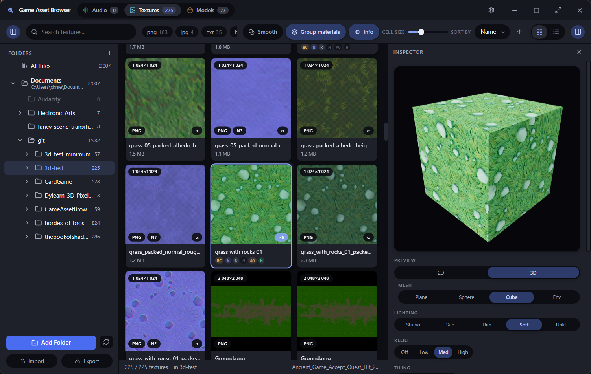
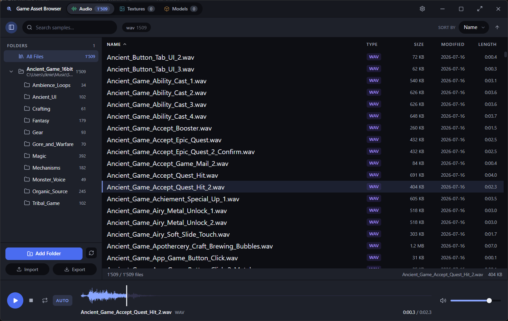
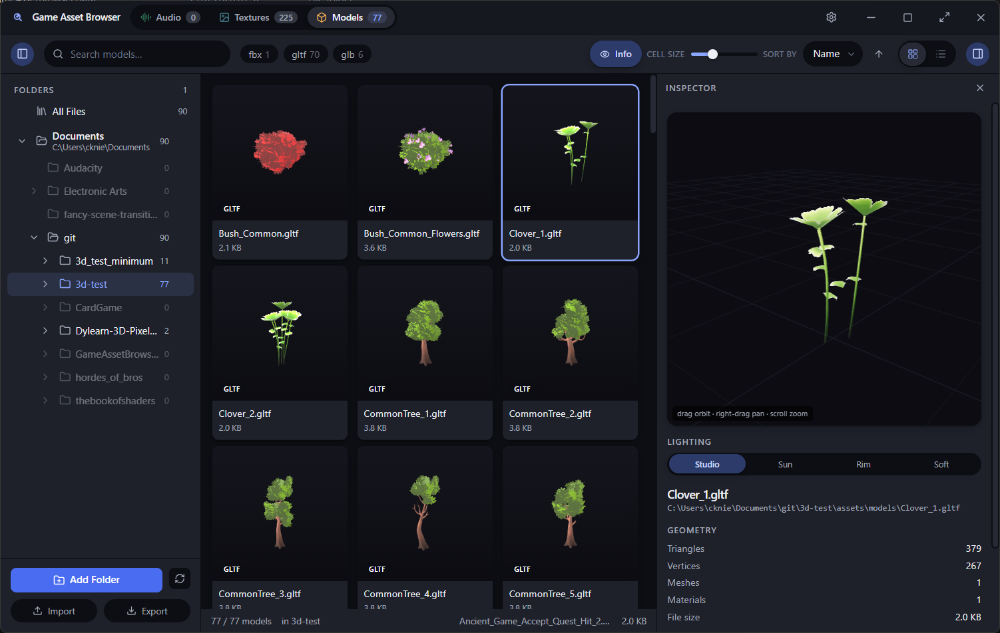

# Game Asset Browser

A fast desktop browser for game asset libraries — **audio, 2D textures, 3D models,
and documents in one place**, with instant preview and without opening a game engine. Built
for big packs (Synty, ambientCG / freestylized, Megascans, HDRIs, Kenney, SFX libraries)
where your file explorer gives up and the engine importer is too slow to browse.

  

One library, four lenses. The sidebar folder tree, collections, search, and filters are
shared; each tab (**Audio**, **2D**, **3D**, **Docs**) adds the preview and facets that make
sense for that kind, and an **All** tab shows every kind at once. Scanning streams in
batches, decoding happens natively in Rust, and everything you filter or sort is derived
in-memory — 20k+ file libraries stay smooth.

---

## Features

### Shared across every tab
- **Recursive multi‑root scanning**, streamed in batches so large libraries fill in
  progressively and stay responsive.
- **Folder tree** with live per‑folder counts — click any subfolder to scope the view to
  that subtree, ctrl‑click to combine folders, hide folders you don't care about.
- **Collections, Favorites & Recent** — usable both as folder‑like scopes ("show me all my
  favourites") and as filters that narrow the current view.
- **Rich filtering** — instant text search, sortable columns, and per‑kind facets (format,
  size, date, and more below), all with live result counts.
- **Grid or list**, with a thumbnail‑size slider, an info‑pill toggle for the format /
  dimension / size badges, and **shuffle** to jump to a random item.
- **Pixel‑art mode** — nearest‑neighbour scaling across the thumbnail grid and every preview
  at once, so sprite work stays crisp instead of smearing as it scales.
- **Ten themes** — five dark (Midnight, Ember, Forest, Orchid, Glacier) and five light
  (Daylight, Sand, Meadow, Blossom, Frost) — plus a **50–200 % UI scale** that grows the
  whole interface, not just the text.
- **Duplicate finder** (two‑stage content hash) and a **library stats** overview.
- **Native drag‑out** to Explorer / DAWs / engines, **drop a folder in** to add a root,
  **copy image to clipboard**, and **"Open with…"** your own external tools.
- **Persistent, portable‑aware settings** with import/export, and custom window chrome.
- **About dialog** (settings menu) with the exact version, commit, and build date, plus the
  full third‑party attributions embedded in the app itself.

### Audio

  

- Instant native playback (Rust `rodio` + `symphonia`): `wav`, `mp3`, `flac`, `ogg`,
  `aiff`, `m4a` — click or arrow‑key through files and hear them immediately.
- **Waveform** with click‑to‑seek playhead, plus an on‑demand **spectrogram**.
- Transport with play/pause, loop, volume, **playback speed**, **auto‑advance**, and
  **shuffle**.
- The transport follows your selection: picking a non‑audio file pauses and hides the bar,
  leaving the track loaded so returning to it resumes where you left off.
- Cover art when a file has it, a rendered waveform when it doesn't — either way every clip
  is identifiable from the grid.
- Facets for **duration**, **sample rate**, and **channel layout**.

### 2D — textures & materials
- GPU‑accelerated thumbnail grid, decoding `png` `jpg` `bmp` `tga` `dds` `tif` `exr` `hdr`
  `gif` `webp` `avif` natively.
- **Vector** — `svg` rasterizes at whatever size it is shown at, so thumbnails and the
  preview panel are both sharp rather than an upscaled bitmap.
- **Layered art** — `psd`/`psb`, Krita `kra`, and Aseprite `ase`/`aseprite` render from
  their composite, and Krita/Aseprite additionally expose the **layer tree, frames, and
  tags**, so you can toggle layers and step animation frames without opening the editor.
- **Camera RAW** — `cr2` `cr3` `nef` `arw` `dng` `raf` `orf` `rw2` and friends, decoded
  from the embedded preview each file carries (fast, and no demosaic pipeline to maintain).
- Affinity `afphoto` / `afdesign` / `afpub` show their embedded preview image. Read‑only
  and unaffiliated with Serif — the layer data in current Affinity versions is not
  documented, so only the preview is available.
- **Material grouping**: loose PBR maps (`Rock_D` + `Rock_N` + `Rock_ORM`…) collapse into a
  single material, with channel roles resolved **per group** (base color, normal,
  roughness, metallic, AO, height, …).
- **2D & 3D preview** — inspect a texture flat, or on a plane / sphere / cube / environment
  with lighting, relief, and tiling controls; **HDR/EXR** environments supported.
- Facets for **color**, **resolution**, **shape** (square, power‑of‑two), and **channel**,
  plus a manual **atlas picker** for packs where the base‑color map can't be inferred.

### 3D — models

  

- three.js viewport for **glTF/GLB, FBX, OBJ, DAE, 3DS, STL, PLY** — rendered thumbnails in
  the grid and a live **orbit / pan / zoom** preview with lighting presets (studio, sun,
  rim, soft).
- Inspection toggles: **wireframe**, a **UV checker** in place of base‑colour maps, a
  **human silhouette** for scale, and a slow **turntable**.
- Geometry inspector: triangles, vertices, meshes, materials, and file size at a glance.

### Docs — reference & reading
- Reference material lives with the art it belongs to: **PDF**, Markdown, and plain text,
  plus **ebooks** (`epub`, `mobi`, `azw3`, `fb2`) and **comics** (`cbz`).
- Paged or scrolling PDF layout, adjustable reading width and text settings for reflowable
  formats, and your place is kept when you change them.
- A **reading theme** for prose — sepia paper or soft dark — chosen independently of the app
  theme, because a dark app with a light page is a perfectly normal way to work.

---

## Keyboard shortcuts

| Key | Action |
| --- | --- |
| ↑ / ↓ | Move selection (by row in a grid); auto‑plays on the Audio tab |
| ← / → | Seek ∓2 s in the audio list · move one cell in a grid |
| Space | Play / pause (Audio) · open the fullscreen preview (2D / 3D) |
| Enter | Replay the current audio file |
| L | Toggle loop |
| F | Toggle favorite (the whole selection when the focused item is part of it) |
| Ctrl + 1 … 5 | Switch to All / Audio / 2D / 3D / Docs |
| Ctrl + A | Select all visible · Escape collapses a multi‑selection |
| F11 | Toggle window fullscreen |

## Platforms

Windows is the primary, most‑tested target (WebView2). **macOS (WKWebView)** and
**Linux (webkit2gtk)** are supported for the core experience — browsing, filtering, and all
three preview types — via platform‑aware asset serving. A few niceties (reveal‑in‑file‑
manager on Linux, some external‑app conveniences) are still being finished.

## Building it yourself

Ready‑to‑run builds are sold; building from source is a permitted alternative, not a
loophole. See **[DEVELOPMENT.md](DEVELOPMENT.md)** for prerequisites, the dev/build commands,
how the app is put together, and the release and code‑signing setup.

## License

Source‑available under the [Game Asset Browser License 1.0.0](LICENSE.md) — source‑available,
not open source:

- **Use it for any purpose, including commercially.** Hobby, freelance, and studio production
  are all permitted, for individuals and companies alike. There is no separate commercial
  license to buy.
- **Build it yourself and modify it** to suit your needs.
- **Everything you make with it is yours** — the license reaches the software only, never your
  artwork, audio, models, or documents.
- **You may not redistribute or resell it**, modified or not, free or paid.

Third‑party components are listed with their licenses in
[THIRD-PARTY-LICENSES.md](THIRD-PARTY-LICENSES.md). Every dependency is permissively
licensed (MIT / Apache‑2.0 / BSD / ISC / Zlib / MPL‑2.0); nothing in the tree is GPL, AGPL,
or otherwise restricts commercial distribution. The MPL‑2.0 components (the symphonia audio
decoders and the cssparser family) are used unmodified, so pointing at their upstream source
is all MPL §3.2 asks for.
